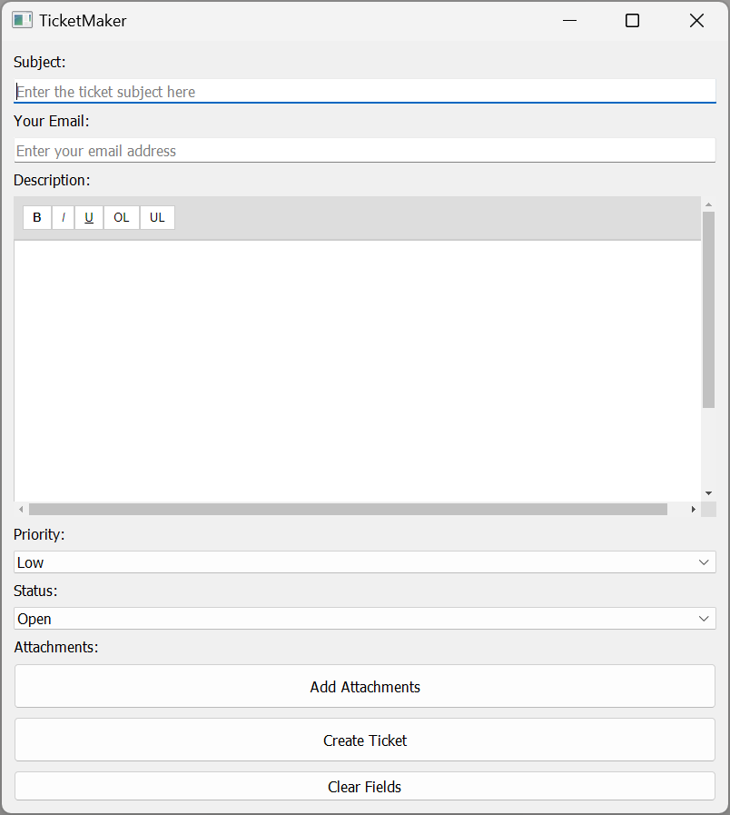
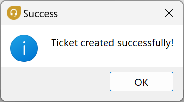

# TicketMaker - Freshdesk Ticket Creator



## Overview

**TicketMaker** is a Python application designed to simplify creating support tickets in a Freshdesk system. This repository contains the full version of the application:

## Full Version

### Features

- **Rich Text Editor**: Supports formatted text and embedded images in the ticket description.
- **Embedded Image Handling**: Automatically extracts embedded images and sends them as attachments.
- **File Attachments**: Users can upload additional files to include with their tickets.
- **User-Friendly GUI**: Intuitive fields for entering ticket details.
- **Dropdown Options**: Predefined dropdowns for Priority and Status fields.
- **Validation**: Ensures all required fields are filled before submission.
- **Secure API Integration**: Communicates with the Freshdesk API for ticket creation.

### How It Works

1. **Fill in Required Fields**:
   - **Subject**: Short description of the issue.
   - **Description**: Rich text description with support for images.
   - **Email**: Contact email of the requester.
   - **Priority**: Dropdown to select ticket priority (Low, Medium, High, Urgent).
   - **Status**: Dropdown to select ticket status (Open, Pending, Resolved, Closed).
   - **Attachments**: Add files to include with the ticket.

2. **Submit Ticket**:
   - The app validates the inputs and extracts embedded images.
   - Submits the ticket details and attachments to the Freshdesk API.
   - Displays a success or error message based on the API response.

   

3. **Clear Form**:
   - The fields are reset after successful submission.
   - Embedded images saved during processing are automatically cleaned up.

## Installation

### Common Steps

1. **Clone the Repository**:
   ```bash
   git clone https://github.com/TicketMaker-Community-Project/TicketMaker
   cd TicketMaker
   ```

2. **Install Dependencies**:
   Ensure you have Python 3.x installed and install the required libraries:
   ```bash
   pip install -r requirements.txt
   ```

3. **Configure API Settings**:
   - The installer will prompt you to enter your Freshdesk domain and API key during installation.
   - These values will be stored in the system registry for use by the application.

### Packaging the Application

1. **Create an Executable**:
   Use the following PyInstaller command to package the application:
   ```bash
   pyinstaller --clean --onefile --noconsole --icon="assets/icon.ico" --add-data "assets;assets" --add-data "editor.html;." --hidden-import win32serviceutil --hidden-import win32service --hidden-import win32event --hidden-import servicemanager ticketmaker.py
   ```

2. **Build the Installer**:
   Use the provided Inno Setup script to compile the installer for distribution.

## Notes

- Ensure your Freshdesk API key has the necessary permissions to create tickets.
- Use HTTPS for secure communication with the Freshdesk API.
- Embedded images in the rich text editor will be extracted and attached automatically.

## Contributing

If you want to contribute to this project, feel free to fork the repository, make changes, and submit a pull request.

## License

This project is licensed under the MIT License. See the LICENSE file for details.

---

Thank you for using Ticketmaker! Let us know if you have any questions or suggestions.
