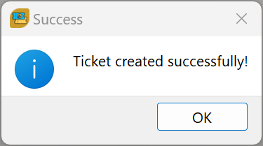

# TicketMaker - Freshdesk Ticket Creator


## Overview

**TicketMaker** is a standalone Windows application designed to simplify creating support tickets in a Freshdesk system. This repository contains the full version of the application.

### Features

- **Rich Text Editor**: Supports formatted text and embedded images in the ticket description.
- **Embedded Image Handling**: Automatically extracts embedded images and sends them as attachments.
- **File Attachments**: Users can upload additional files to include with their tickets.
- **User-Friendly GUI**: Intuitive fields for entering ticket details.
- **Dropdown Options**: Predefined dropdowns for Priority and Status fields.
- **Validation**: Ensures all required fields are filled before submission.
- **Secure API Integration**: Communicates with the Freshdesk API for ticket creation.
- **Interactive and Silent Install Support**: Install the application interactively with user prompts or silently for automated deployments.

### How It Works

1. **Fill in Required Fields**:
   - **Subject**: Short description of the issue.
   - **Description**: Rich text description with support for images.
   - **Email**: Contact email of the requester.
   - **Priority**: Dropdown to select ticket priority (Low, Medium, High, Urgent).
   - **Status**: Dropdown to select ticket status (Open, Pending, Resolved, Closed).
   - **Attachments**: Add files to include with the ticket.

2. **Submit Ticket**:
   - The app validates the inputs and extracts embedded images.
   - Submits the ticket details and attachments to the Freshdesk API.
   - Displays a success or error message based on the API response.

   

3. **Interactive API Configuration**:
   - During installation, the **Configurator** application is launched in interactive mode to collect your Freshdesk API URL and API key.
   - These values are stored securely in the system registry.
   - The **Configurator** can also be run manually to reset the API configuration if needed.

4. **Silent Installation**:
   - TicketMaker supports silent installs for automated deployments. Use the following command in PowerShell to install the application without prompts:
     ```powershell
     msiexec /i "C:\Github\TicketMaker\TicketMakerInstaller.msi" /quiet /log "C:\TicketMakerInstall.log" URL="https://example.com" API_KEY="12345"
     ```

5. **Clear Form**:
   - The fields are reset after successful submission.
   - Embedded images saved during processing are automatically cleaned up.

---

## Installation

### Requirements

- 64-bit Windows operating system.
- **No Python installation required**—TicketMaker is packaged as a standalone executable.

### Common Steps

1. **Clone the Repository**:
   ```bash
   git clone https://github.com/TicketMaker-Community-Project/TicketMaker
   cd TicketMaker
   ```

2. **Installer**:
   - Download the installer `.msi` file.
   - Run the installer interactively or use the silent install command for automated setups.

---

## Packaging the Application

### Creating an Executable

#### TicketMaker

Use the following PyInstaller command to package the `ticketmaker.py` application:

```bash
pyinstaller --clean --onefile --noconsole --icon="assets/icon.ico" --add-data "assets;assets" --add-data "editor.html;." --hidden-import PyQt5.QtWidgets --hidden-import PyQt5.QtWebEngineWidgets --hidden-import PyQt5.QtCore --hidden-import PyQt5.QtGui src/ticketmaker.py
```

#### Configurator

Use the following PyInstaller command to package the `configurator.py` application:

```bash
pyinstaller --clean --onefile --noconsole --icon="assets/icon.ico" --add-data "assets;assets" src/configurator.py
```

### Building the Installer

TicketMaker is packaged using **Advanced Installer** under its open-source developer license. This ensures professional-grade installation features.

---

## Notes

- Ensure your Freshdesk API key has the necessary permissions to create tickets.
- Use HTTPS for secure communication with the Freshdesk API.
- Embedded images in the rich text editor will be extracted and attached automatically.

## Credits

- **Support Ticket Icon**: <a href="https://www.flaticon.com/free-icons/support-ticket" title="support ticket icons">Support ticket icons created by syafii5758 - Flaticon</a>
- **Advanced Installer**: The installer was built using **Advanced Installer** under their open-source developer license. Learn more at [advancedinstaller.com](https://www.advancedinstaller.com).


## Contributing

If you want to contribute to this project, feel free to fork the repository, make changes, and submit a pull request.

## License

This project is licensed under the MIT License. See the LICENSE file for details.

---

Thank you for using TicketMaker! Let us know if you have any questions or suggestions.
